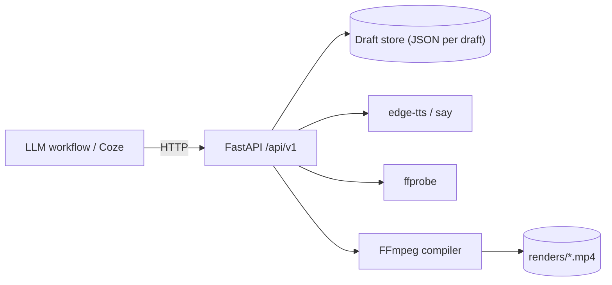

<p align="center">
  <strong>CutWeave</strong> · a cloud-native video editing engine<br>
  Model a draft over HTTP, render with FFmpeg, speak with TTS — built to be driven by LLM workflows.
</p>

<p align="center">
  <a href="LICENSE"></a>
  
  
  
  <a href="https://github.com/Alfred-Lau/cutweave/actions/workflows/ci.yml"></a>
</p>

<p align="center">
  <a href="README.md">English</a> · <a href="README.zh-CN.md">中文</a>
</p>

## Why

Video editing tools are GUI-first. CutWeave is **API-first**: a video is a **timeline draft** (JSON), every edit is an **HTTP call**, and rendering is a **deterministic FFmpeg compile**. That makes it a natural render backend for LLM workflows (e.g. [Coze](https://www.coze.cn)), scripts, and services — no UI, no browser automation, no fragile screen clicking.

```
LLM workflow ──HTTP──▶ CutWeave API ──▶ FFmpeg ──▶ MP4
```

## What it does (P0)

| Capability | How |
| --- | --- |
| Timeline drafts | Canvas + tracks (video / audio / text) + segments with `start / end / source_in`, transform (`x`, `y`, `scale`), alpha, volume |
| Picture-in-picture | Track `level` — level 0 fills the canvas, higher levels overlay as scaled windows |
| Materials | Video / image / audio via URL or local path; auto-probe duration, resolution, audio stream |
| Text layers | Pillow-rendered transparent PNG overlays: outline, `color@alpha`, multi-line, cached by content hash |
| TTS | `POST /ai/tts` — edge-tts by default, automatic fallback to macOS `say` |
| Render | Deterministic FFmpeg graph: base canvas → overlay chain → audio mix (`adelay` + `amix`, `normalize=0`), H.264 + AAC MP4 |
| Integration | FastAPI with OpenAPI 3.0 export, importable as a Coze plugin |

## Quick start

### Local (macOS / Linux, FFmpeg required)

```bash
git clone https://github.com/Alfred-Lau/cutweave.git
cd cutweave/engine
python3 -m venv .venv && source .venv/bin/activate
pip install -r requirements.txt
uvicorn app.main:app --port 8390
```

Run the end-to-end demo (boots its own server, builds a 720×1280 draft with background video + TTS narration + two text layers, renders, and verifies with ffprobe):

```bash
python scripts/demo_e2e.py
```

Run tests:

```bash
python -m pytest tests/ -q
```

### Docker

```bash
cd engine
docker compose up -d --build
curl http://127.0.0.1:8390/api/v1/health
```

Image is `python:3.13-slim` + FFmpeg + Noto CJK fonts; drafts, materials and renders persist in the `engine-data` volume. Inside Linux containers only edge-tts is available (no macOS `say`).

## API (mounted at `/api/v1`)

| Method | Path | Purpose |
| --- | --- | --- |
| GET | `/health` | Health check (incl. font readiness) |
| POST / GET | `/drafts` | Create / list drafts `{name, width, height, fps}` |
| GET / DELETE | `/drafts/{id}` | Full timeline / delete |
| POST | `/drafts/{id}/videos·images·audios·texts` | Add materials or text — single object or batch array |
| PATCH / DELETE | `/drafts/{id}/{resource}/{segment_id}` | Edit timing / transform / style, or remove a segment |
| GET | `/media/probe?url=` | Probe duration / resolution / audio |
| POST | `/ai/tts` | `{text, voice?, engine?}` with automatic engine fallback |
| POST | `/render/tasks` | Sync render `{draft_id, crf?, preset?}` |
| GET | `/render/tasks/{id}` | Render job status |
| GET | `/files/...` | Static downloads for renders / TTS / materials |

Full OpenAPI 3.0 schema: `engine/coze_plugin/openapi.json` (regenerate via `python scripts/export_openapi.py`).

## Architecture



Design decisions:

- **Draft = JSON document.** The whole timeline serializes to one file per draft; segments reference materials by id. Cheap to store, diff, and replay.
- **Text without drawtext.** Many cloud FFmpeg builds ship without libfreetype, so text is pre-rendered to transparent PNG (Pillow) and overlaid like any image — the same graph runs on a Mac and in a slim container.
- **Audio mixing without clipping.** `amix` runs with `normalize=0`; each segment gets its own `adelay` + `volume` instead of relying on auto-attenuation.
- **Sync render for now.** P0 targets short drafts (< 1 min). P1 adds a task bus with webhook callbacks.

`docs/个人云端视频生产系统架构设计.html` contains the full system architecture (layers, Coze integration, roadmap) — Chinese.

## Roadmap

- **P1** — async render task bus + webhook callbacks · ASR subtitles · Coze plugin publication
- **P2** — workflow interpreter (`execute_workflow`-style batch scripts) · templates / presets · render farm (queue + multiple workers)
- **P3** — stock media library · production dashboards

## Ecosystem

CutWeave is part of the [SoloKit](https://www.solokit.run/) line for one-person companies, alongside [OPC-Fellows](https://github.com/Alfred-Lau/OPC-Fellows) — a local-first workbench with a Cordis kernel and occupation plugins.

## Contributing

Issues and PRs are welcome. See [CONTRIBUTING.md](CONTRIBUTING.md) for local setup and conventions.

## License

[MIT](LICENSE)
