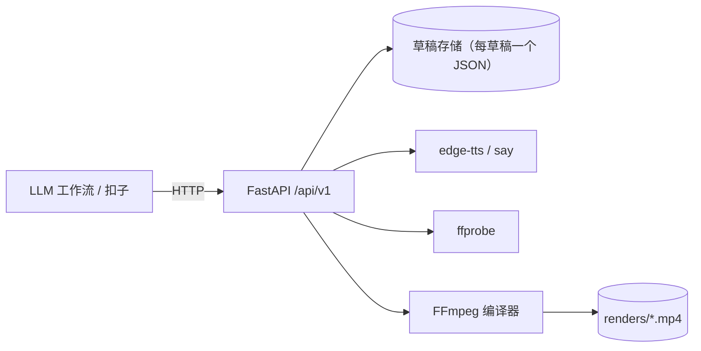

<p align="center">
  <strong>CutWeave</strong> · 云端视频剪辑引擎<br>
  用 HTTP 建草稿、用 FFmpeg 渲染、用 TTS 配音——为大模型工作流而生。
</p>

<p align="center">
  <a href="LICENSE"></a>
  
  
  
  <a href="https://github.com/Alfred-Lau/cutweave/actions/workflows/ci.yml"></a>
</p>

<p align="center">
  <a href="README.md">English</a> · <a href="README.zh-CN.md">中文</a>
</p>

## 为什么做它

剪辑软件都是 GUI 优先的。CutWeave 反过来，是 **API 优先**：一条视频就是一个**时间线草稿**（JSON），每一次剪辑就是一次 **HTTP 调用**，渲染是一次**确定性的 FFmpeg 编译**。这让它天然适合作为 LLM 工作流（比如[扣子](https://www.coze.cn)）、脚本和服务的渲染后端——没有界面依赖，不需要浏览器自动化，更不靠模拟点击。

```
LLM 工作流 ──HTTP──▶ CutWeave API ──▶ FFmpeg ──▶ MP4
```

## 它能做什么（P0）

| 能力 | 说明 |
| --- | --- |
| 时间线草稿 | 画布 + 轨道（video / audio / text）+ 片段（`start / end / source_in`），支持变换（`x`、`y`、`scale`）、透明度、音量 |
| 画中画 | 轨道 `level`——0 层铺满画布，更高层按缩放叠加成小窗 |
| 素材 | 视频 / 图片 / 音频，支持 URL 或本地路径；自动探测时长、分辨率、音轨 |
| 文字层 | Pillow 预渲染透明 PNG 后叠加：支持描边、`color@alpha` 半透明色、多行，按内容哈希缓存 |
| TTS | `POST /ai/tts` —— 默认 edge-tts，失败自动降级 macOS `say` |
| 渲染 | 确定性 FFmpeg 图：底色画布 → 叠加链 → 音频混音（`adelay` + `amix`、`normalize=0`），输出 H.264 + AAC MP4 |
| 集成 | FastAPI + OpenAPI 3.0 导出，可直接导入扣子插件 |

## 快速开始

### 本地运行（macOS / Linux，需要 FFmpeg）

```bash
git clone https://github.com/Alfred-Lau/cutweave.git
cd cutweave/engine
python3 -m venv .venv && source .venv/bin/activate
pip install -r requirements.txt
uvicorn app.main:app --port 8390
```

一键端到端演示（自动起停服务：搭一条 720×1280 草稿——背景视频 + TTS 旁白 + 两条文字层，渲染成片并用 ffprobe 验证）：

```bash
python scripts/demo_e2e.py
```

跑测试：

```bash
python -m pytest tests/ -q
```

### Docker 部署

```bash
cd engine
docker compose up -d --build
curl http://127.0.0.1:8390/api/v1/health
```

镜像基于 `python:3.13-slim`，自带 FFmpeg 与 Noto CJK 中文字体；草稿、素材、成片持久化在 `engine-data` 卷。Linux 容器内 TTS 仅 edge-tts 可用（无 macOS `say`）。

## API 一览（挂载在 `/api/v1`）

| 方法 | 路径 | 说明 |
| --- | --- | --- |
| GET | `/health` | 健康检查（含字体就绪状态） |
| POST / GET | `/drafts` | 创建 / 列出草稿 `{name, width, height, fps}` |
| GET / DELETE | `/drafts/{id}` | 完整时间线 / 删除草稿 |
| POST | `/drafts/{id}/videos·images·audios·texts` | 添加素材或文字，单个对象或数组批量 |
| PATCH / DELETE | `/drafts/{id}/{resource}/{segment_id}` | 修改时间 / 变换 / 样式，或删除片段 |
| GET | `/media/probe?url=` | 探测时长 / 分辨率 / 音轨 |
| POST | `/ai/tts` | `{text, voice?, engine?}`，引擎自动降级 |
| POST | `/render/tasks` | 同步渲染 `{draft_id, crf?, preset?}` |
| GET | `/render/tasks/{id}` | 渲染任务状态 |
| GET | `/files/...` | 成片 / TTS / 素材静态下载 |

完整 OpenAPI 3.0 schema：`engine/coze_plugin/openapi.json`（可用 `python scripts/export_openapi.py` 重新生成）。

## 架构



核心设计决策：

- **草稿即 JSON 文档**：整条时间线序列化为每个草稿一个文件，片段按 id 引用素材。存储、diff、重放都便宜。
- **文字渲染不依赖 drawtext**：很多云端 FFmpeg 构建不带 libfreetype，所以文字先用 Pillow 预渲染成透明 PNG，再当普通图片叠加——同一条命令图在 Mac 和 slim 容器里都能跑。
- **混音不过载**：`amix` 用 `normalize=0`，每个片段独立 `adelay` + `volume`，不依赖自动衰减。
- **当前为同步渲染**：P0 面向 1 分钟内的短草稿；P1 引入任务总线 + Webhook 回调。

`docs/个人云端视频生产系统架构设计.html` 有完整的系统架构设计（分层、扣子集成、路线图）。

## 路线图

- **P1** — 异步渲染任务总线 + Webhook 回调 · ASR 智能字幕 · 扣子插件发布
- **P2** — 工作流解释器（`execute_workflow` 风格批量脚本）· 模板预设 · 渲染农场（队列 + 多 Worker）
- **P3** — 素材库 · 生产看板

## 生态

CutWeave 属于 [SoloKit](https://www.solokit.run/) 单人公司产品线，与 [OPC-Fellows](https://github.com/Alfred-Lau/OPC-Fellows)（local-first 工作台，Cordis 内核 + 职业插件）同属一个体系。

## 参与贡献

欢迎提 issue 和 PR，本地开发与约定见 [CONTRIBUTING.md](CONTRIBUTING.md)。

## License

[MIT](LICENSE)
